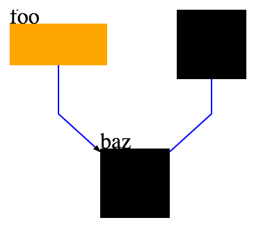

dagre-react is a JavaScript library which provides a Graph React component and does automatic layout,
so you can render directed graphs just from vertex and edge data:

``` .javascript
var Example = React.createClass({
    render: function() {
        var toVertex = function(name) {
            return (
                <Vertex width={50} height={50}
                        key={name}>
                    <rect width={50} height={50} />
                    <text>
                        {name}
                    </text>
                </Vertex>
            );
        };
        
        var arrow = "<marker id=\"markerArrow\" markerWidth=\"6\" markerHeight=\"4\" \
                             refx=\"5\" refy=\"2\" orient=\"auto\"> \
                         <path d=\"M 0,0 V 4 L6,2 Z\" class=\"arrow\" /> \
                     </marker>";

        return (
            <svg width="500" height="500">
                <defs dangerouslySetInnerHTML={{__html: arrow}} />

                <Graph className="graph">
                    {["bar", "baz"].map(toVertex)}
                    <Vertex width={70} height={30}
                            key={"foo"}
                            className="foo">
                        <rect width={70} height={30} />
                        <text>
                            {"foo"}
                        </text>
                    </Vertex>

                    <Edge markerEnd="url(#markerArrow)" source="foo" target="baz" />
                    <Edge source="bar" target="baz" />
                </Graph>
            </svg>
        );
    }
});
```

produces something like this (with styles):

</img>

You can make the vertices' children arbitrary React components;
at the moment, edges are just SVG paths.

It uses the dagre library to lay out your graph.

Make sure you compile JSX files back to JS if you change them.
